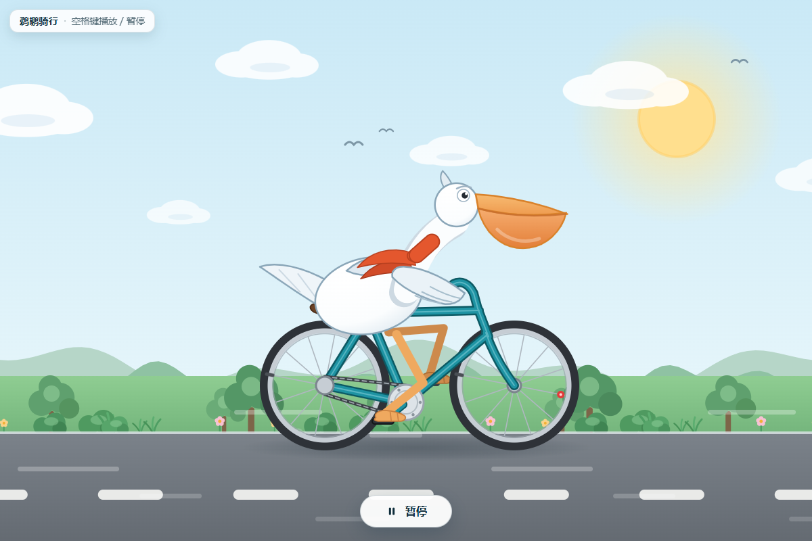
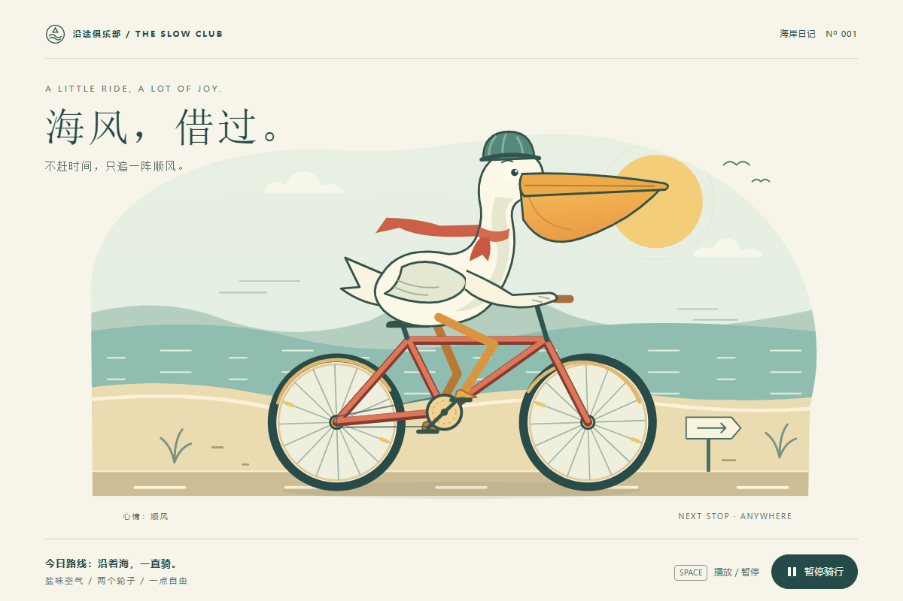
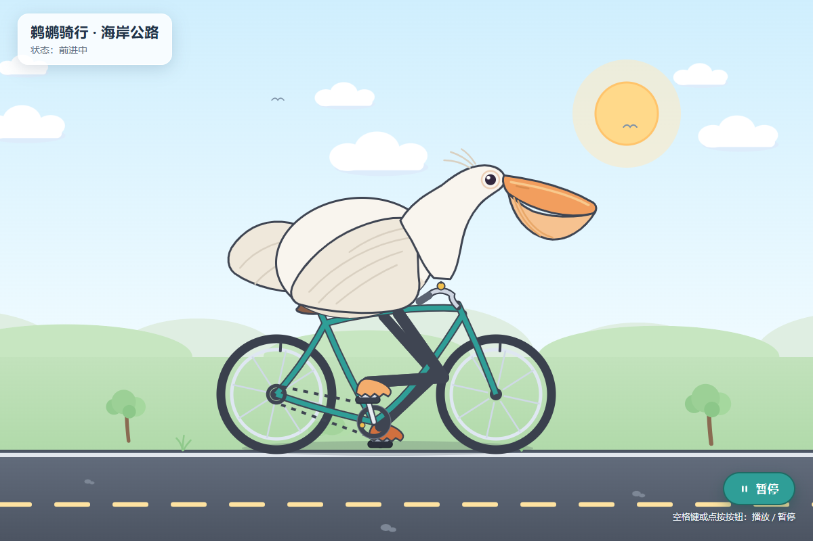

<div align="center">

# 🚲 鹈鹕骑车 · Pelican Bike Benchmark

### 用同一份提示词，观察不同 AI 模型如何完成同一个前端视觉任务

**固定提示词 · 厂家 / 模型 / 推理强度三级浏览 · 原始输出留存 · 桌面 / 手机实测 · 多作品并排对比**

<p>
  <strong>导航</strong><br/>
  <a href="https://qrzzzz.github.io/pelican-bike-benchmark/">在线浏览</a> ·
  <a href="https://qrzzzz.github.io/pelican-bike-benchmark/method.html">测试方法</a> ·
  <a href="./CONTRIBUTING.md">提交作品</a> ·
  <a href="https://github.com/Qrzzzz/pelican-bike-benchmark">GitHub 仓库</a>
</p>


</div>

---

<details>
<summary><strong>🖼️ 展开查看部分作品</strong></summary>

<table>
  <tr>
    <td width="33%" align="center" valign="top">
      <sub><b>DeepSeek 4.1 Flash · max</b></sub><br/>
      
    </td>
    <td width="33%" align="center" valign="top">
      <sub><b>GPT-6 Astra · high</b></sub><br/>
      
    </td>
    <td width="33%" align="center" valign="top">
      <sub><b>GLM 5.3</b></sub><br/>
      
    </td>
  </tr>
</table>

这些截图均来自对应原始 HTML 在统一浏览器测试环境中的实际运行结果，不是重新生成的示意图。

</details>

## 🧪 这是什么

Pelican Bike Benchmark 是一个面向生成式 AI 前端能力的可复现实验站。

所有正式作品都围绕同一个任务：

> 创建一个完整的单文件 HTML，让一只鹈鹕骑着自行车前进，并同时满足插画表现、循环动画、交互控制、响应式布局和无障碍要求。

项目尽量固定提示词、目标视口和浏览器检查方法，同时保留不同模型真实执行环境之间的差异。

这里关注的不是单一截图，也不是一个“谁最好”的排行榜，而是完整保留：

- 模型实际返回了什么
- 页面能否直接运行
- 桌面与手机效果如何
- 动画和交互是否工作
- `prefers-reduced-motion` 是否得到尊重
- 原始输出是否被修改
- 不同厂家、模型和推理强度之间出现了哪些实现差异

原始输出、SHA-256、运行环境、截图和浏览器检查记录会与作品一起保存，方便回看与复现。

## ✨ 主要功能

### 🗂️ 厂家 → 模型 → 推理强度三级浏览

作品按厂家、模型和推理强度组织。

可以从同一家厂商逐层查看不同模型，再比较同一模型在不同推理强度下生成的结果。推理强度保留各平台提供的原始值，不尝试把不同厂商的等级强行换算到同一尺度。

搜索和筛选条件会保存在 URL 中，可以直接分享当前视图。

### 🔍 作品详情

每个正式作品都有独立详情页，可查看：

- 桌面与手机实际运行截图
- 沙盒运行预览
- 原始模型输出
- 浏览器端 SHA-256 核对
- 模型厂家、模型名称与精确版本记录
- 推理强度及其他生成参数
- 固定输入
- 生成与测试环境
- 静态检查结果
- 浏览器运行检查
- 来源与首次输出声明
- 可选的独立评审记录

原始输出以不可变文件保存，不通过后期修补让作品“通过测试”。

### ⚖️ 2–4 项并排对比

可以选择 2–4 个作品进入对比页，在统一视口下观察差异。

支持：

- `1200 × 800` 桌面视口
- `390 × 844` 手机视口
- 实测截图
- 沙盒运行版本
- 可分享的对比链接

选中的作品会在当前会话中保留，可以继续浏览作品库后再加入或移除。

### 🖥️ 桌面与手机实测

正式作品可附带两组真实浏览器截图：

- 桌面：`1200 × 800`
- 手机：`390 × 844`
- DPR：`1`

浏览器检查还可以记录：

- 是否出现横向溢出
- 页面是否存在预期动态
- 播放 / 暂停按钮是否工作
- 空格键是否能够切换动画
- 控制台是否出现脚本异常
- 减少动态模式下是否默认静止
- 减少动态模式下是否仍可手动播放

这些检查用于记录可观察行为，不等同于画面质量评分。

### 🧾 原始输出与可追溯记录

每个作品都保留模型首次返回的原始字节，并生成 SHA-256。

项目同时记录可获得的：

- 生成日期
- 模型版本
- 推理强度
- 工具使用情况
- 执行环境
- 运行编号
- 提示词校验
- 投稿来源

未知信息明确标记为“未记录”，不会使用文件修改时间或其他间接数据冒充真实生成信息。

### ♿ 响应式与减少动态

固定提示词不只要求“画得像”，还要求生成结果能够作为真正的网页运行。

任务包括：

- 手机窄屏适配
- 无横向滚动
- 可见的键盘焦点
- 可操作的播放 / 暂停控件
- 空格键交互
- `prefers-reduced-motion`
- 清晰可辨的鹈鹕与自行车
- 平滑循环动画
- 无控制台错误

因此，同一个任务会同时考察视觉生成、HTML / CSS / JavaScript 实现、响应式设计与基础可访问性。

## 📐 测试协议

当前正式批次使用固定的 `v1` 提示词。

提示词要求模型只输出一个完整 HTML 文件，不允许：

- 外部图片
- CDN
- 第三方库
- 外链字体
- 网络请求
- base64 位图

允许使用内嵌 CSS、SVG、Canvas 和原生 JavaScript。

视觉任务要求在 `1200 × 800` 视口下能够一眼辨认鹈鹕与自行车，并包含道路、天空或其他能够体现前进感的环境。

交互任务要求作品具有循环动画、播放 / 暂停按钮、空格键控制，同时正确处理减少动态偏好。

完整提示词、评分维度、导入规则和测试约定见：

**[测试方法 →](https://qrzzzz.github.io/pelican-bike-benchmark/method.html)**

固定输入原文件位于：

```text
site/data/prompt.v1.json
```

SHA-256 基于其中 `text` 字段的 UTF-8 原始字节计算，使用 LF 且无末尾换行。

## 📥 通过 PR 提交作品

项目接受真实模型首次输出投稿。

不要求作品必须成功运行。静态检查失败的首次原始输出仍可登记，只会停用运行预览并公开失败原因。

投稿前请确认：

1. 原样使用当前固定提示词，没有追加提示。
2. 保存模型的首次输出，没有手动修复 HTML。
3. 如实填写厂家、模型、版本、推理强度和执行环境。
4. 不确定的信息写“未记录”，不要推测。
5. 一个新的生成结果使用新的唯一 ID。

初始化一份投稿：

```sh
npm ci --ignore-scripts
npm run submission:init -- model-effort-20260912-run01
```

填写生成的元数据，然后导入：

```sh
npm run import -- \
  --source ./result.txt \
  --meta ./output/model-effort-20260912-run01.meta.json

npm run check
```

已有符合协议的桌面和手机截图时，也可以一并导入：

```sh
npm run import -- \
  --source ./result.txt \
  --meta ./output/model-effort-20260912-run01.meta.json \
  --desktop ./desktop.png \
  --mobile ./mobile.png
```

完整字段规范、PR 范围限制和 Action 检查流程见：

**[CONTRIBUTING.md](./CONTRIBUTING.md)**

## 💻 本地运行

需要 Node.js 22 或更新版本。

```sh
git clone https://github.com/Qrzzzz/pelican-bike-benchmark.git
cd pelican-bike-benchmark

npm ci
npm run check
npm run dev
```

然后访问：

```text
http://127.0.0.1:4173/pelican-bike-benchmark/
```

本地服务器也支持根路径，便于检查 GitHub Pages 子路径兼容性。

页面会通过 `fetch` 读取作品和提示词 JSON，因此不要直接双击 HTML 文件进行完整功能测试。

## 🗃️ 项目结构

```text
pelican-bike-benchmark/
├─ site/
│  ├─ index.html                  # 作品库
│  ├─ compare.html                # 多作品对比
│  ├─ entry.html                  # 作品详情
│  ├─ method.html                 # 测试方法
│  ├─ assets/                     # 站点样式、脚本与字体
│  ├─ data/
│  │  ├─ prompt.v1.json           # 固定提示词
│  │  └─ submissions.json         # 作品索引
│  └─ submissions/
│     └─ <id>/
│        ├─ source.html.txt        # 原始模型输出
│        ├─ meta.json              # 元数据
│        ├─ preview.html           # 沙盒预览包装
│        ├─ desktop.png            # 桌面实测截图
│        └─ mobile.png             # 手机实测截图
├─ scripts/                       # 导入、检查与证据处理
├─ tests/                         # 自动化测试
├─ CONTRIBUTING.md                # 投稿规范
└─ THIRD_PARTY_NOTICES.md         # 第三方声明
```

站点本身使用原生 HTML、CSS 和 JavaScript，不依赖前端运行时框架，也没有线上构建步骤。

## 🔒 预览隔离

模型生成的网页属于不受信任内容，因此不会直接注入主站页面。

原始结果保存在：

```text
source.html.txt
```

运行时使用固定的 `preview.html` 包装，并将作品放入：

```html
<iframe sandbox="allow-scripts">
```

预览没有启用同源、弹窗、表单、下载或顶层导航权限。

包装页同时使用 CSP 限制：

- 网络连接
- 外部资源
- 嵌套框架
- Worker
- 表单提交
- 其他不需要的浏览器能力

导入器还会静态检查危险标签、外部资源引用，以及脚本或事件处理器中的常见网络、导航和动态代码接口。

这些措施用于降低直接运行模型生成代码的风险，但不构成通用 JavaScript 安全证明，也不能隔离 CPU 或内存滥用。投稿内容仍需要人工审阅。

## ✅ 验证与发布

运行完整检查：

```sh
npm run check
```

检查内容包括：

- 导入原始字节保真
- 固定提示词一致性
- SHA-256
- 作品元数据与索引一致性
- 重复 ID
- 路径穿越
- 危险资源
- 静态检查报告
- 沙盒包装
- 截图协议
- 评分字段约束
- 页面静态链接
- 失效作品处理

投稿 PR 还会运行单独的 `Submission contract`，限制普通投稿只能修改新增作品及对应索引，避免通过作品 PR 覆盖已有原始输出或夹带站点代码修改。

合并到 `main` 后，GitHub Actions 会再次验证并发布 `site/` 到 GitHub Pages。

线上地址：

**https://qrzzzz.github.io/pelican-bike-benchmark/**

## 🔬 复现浏览器证据

需要重新验证某个作品时，可以先启动本地服务器，再生成该作品对应的浏览器捕获脚本。

```sh
npm run prepare:capture -- <run-id>

npx --yes --package @playwright/cli@0.1.19 \
  playwright-cli -s=pelican-capture \
  open http://127.0.0.1:4173/

npx --yes --package @playwright/cli@0.1.19 \
  playwright-cli -s=pelican-capture \
  run-code --filename output/capture.js \
  > output/capture.log

node scripts/attach-evidence.mjs output/capture.log
```

减少动态测试使用独立浏览器会话：

```sh
npx --yes --package @playwright/cli@0.1.19 \
  playwright-cli -s=pelican-reduced \
  open --config output/reduced-browser.json \
  http://127.0.0.1:4173/

npx --yes --package @playwright/cli@0.1.19 \
  playwright-cli -s=pelican-reduced \
  run-code --filename output/reduced-check.js \
  > output/reduced-check.log

node scripts/attach-evidence.mjs output/reduced-check.log
npm run check
```

截图与实测记录可以后续补充或重新验证，但对应作品的原始输出不可修改。

检查规则发生变化时，可使用：

```sh
node scripts/recheck.mjs
```

重新生成派生静态报告和预览包装，再对受影响作品进行复核。

## 🎨 界面与设计来源

站点采用暖纸色 / 炭灰双主题、青色点缀、衬线标题和较大的阅读留白。

主题支持：

- 跟随系统深浅色偏好
- 手动切换
- 本机保存选择
- 禁用本地存储时仍可切换
- `prefers-reduced-motion`
- 键盘焦点状态

部分设计 token、主题切换结构和界面模式改编自 [Qrzzzz.github.io](https://github.com/Qrzzzz/Qrzzzz.github.io)。

完整来源、MIT 声明及本地字体许可证见：

**[THIRD_PARTY_NOTICES.md](./THIRD_PARTY_NOTICES.md)**

## 📄 数据原则

这个项目优先保留证据，而不是补齐看起来更完整的数据。

因此：

- 未记录的生成日期保持 `null`
- 未提供的模型参数标记为“未记录”
- 不用文件时间代替真实生成时间
- 不修改失败输出
- 不用生成插画冒充浏览器截图
- 静态检查通过不等于完整浏览器验收
- 浏览器行为检查不等于视觉质量评分
- 不把不同执行平台记录成完全相同的实验环境

目标不是消除所有不可控变量，而是把能够固定的条件固定下来，把无法固定的差异明确记录下来。

---

<div align="center">

**同一个任务，不同的模型，不同的实现。**

[在线浏览](https://qrzzzz.github.io/pelican-bike-benchmark/) ·
[测试方法](https://qrzzzz.github.io/pelican-bike-benchmark/method.html) ·
[提交作品](./CONTRIBUTING.md)

</div>
